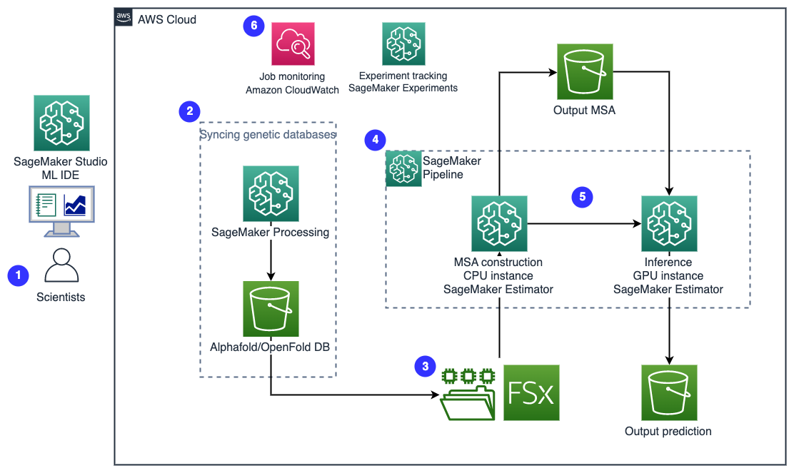
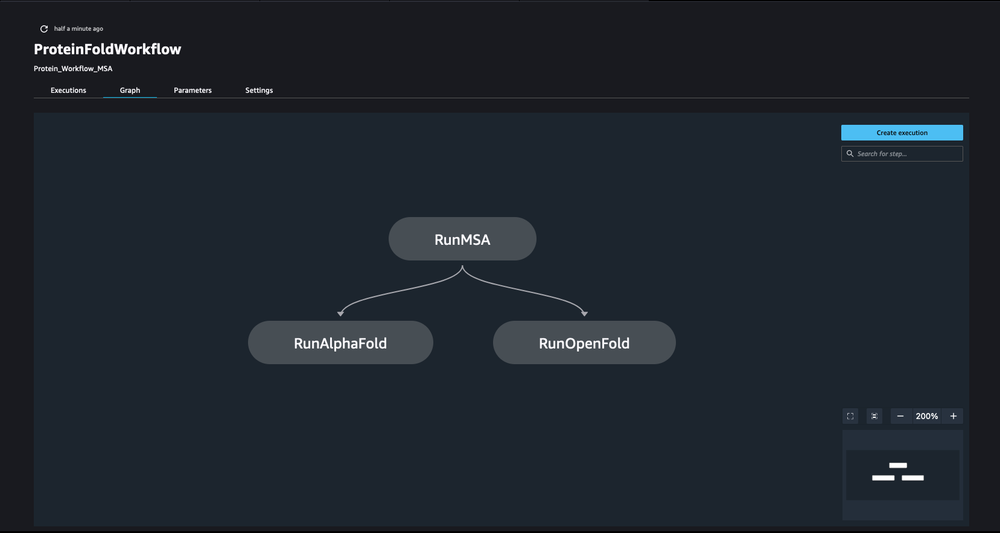
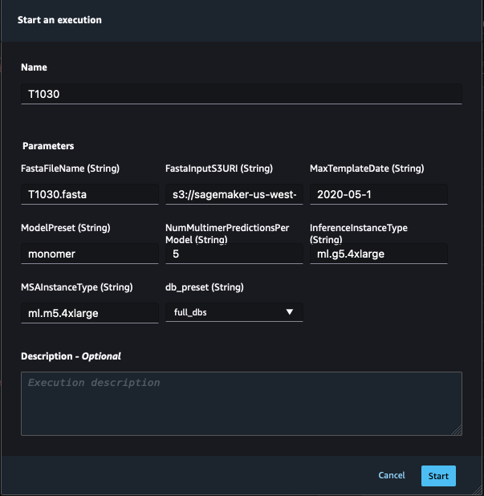

## Introduction

Amazon SageMaker is a fully managed service to prepare, build, train, and deploy high-quality machine learning (ML) models quickly by bringing together a broad set of capabilities purpose-built for ML. It offers a fully-managed environment for ML, abstracting away the infrastructure, data management, and scalability requirements so users can focus on building, training, and testing ML models.

Here we present a fully managed machine learning solution with Amazon SageMaker that simplifies the operation of protein folding structure prediction workflows.

## Solution overview

See blog for overview and benefits: \<Link to Blog Post Coming Soon\>



## Notebooks

This repositroy contains 5 key notebooks:

1. [00-prerequisite.ipynb](https://github.com/aws-samples/amazon-sagemaker-protein-folding-workflows/blob/main/00-prerequisite.ipynb): Configures the pre-requisites required to run this solution including the building of docker images, downloading the AlphaFold genetic database, and provisioing the FSx for Lustre file system.
2. [01-proteinfolding\_stepbystep.ipynb](https://github.com/aws-samples/amazon-sagemaker-protein-folding-workflows/blob/main/01-proteinfolding_stepbystep.ipynb): Shows the process of using SageMaker SDK to compute MSAs, run AlphaFold, run OpenFold, visualize the outputs, and analyze the protein structures. This notebook is useful to understand the core concepts but is not intended to be used for repeated experiments.
3. [02-define\_proteinfolding\_pipeline.ipynb](https://github.com/aws-samples/amazon-sagemaker-protein-folding-workflows/blob/main/02-define_proteinfolding_pipeline.ipynb): Defines the SageMaker Pipeline which creates an ML workflow where the pipeline takes care of managing data between steps, orchestrating their execution, and logging.
4. [03-run\_proteinfolding\_pipeline.ipynb](https://github.com/aws-samples/amazon-sagemaker-protein-folding-workflows/blob/main/03-run_proteinfolding_pipeline.ipynb): Example code to execute the SageMaker Pipeline using the boto3 client.
5. [04-compare\_alphafold\_openfold.ipy](https://github.com/aws-samples/amazon-sagemaker-protein-folding-workflows/blob/main/04-compare_alphafold_openfold.ipynb): Example code to take the output of the SageMaker pipeline and visualize/analyze the output of AlphaFold/OpenFold and log it to SageMaker Experiments. SageMaker Experiments lets you create, manage, analyze, and compare your machine learning experiments.

## 00-prerequisite.ipynb

To run this solution, you need to have a number of prerequisites complete.

1. SageMaker domain and a user profile
2. IAM Policies
3. Network
4. Run 00-prerequisite.ipynb  to download the genetic database and create a filesysten.

### SageMaker domain and user profile

You need to have a SageMaker domain and a user profile. If you don't have a Studio domain, refer to [Onboard to Amazon SageMaker Domain Using Quick Setup](https://docs.aws.amazon.com/sagemaker/latest/dg/onboard-quick-start.html).

Once you have the SageMaker domain properly setup, open Studio from your user profile, and clone the solution repository into the Studio in a system terminal.

```
$ git clone git@github.com:aws-samples/amazon-sagemaker-protein-folding-workflows.git
```

### IAM policies

To follow this example, you can attach [AmazonSageMakerFullAccess](https://us-east-1.console.aws.amazon.com/iam/home#/policies/arn:aws:iam::aws:policy/AmazonSageMakerFullAccess) policy in your IAM user as a baseline.

To build a Docker container image, you can use either a local Docker client or the [SageMaker Docker Build](https://pypi.org/project/sagemaker-studio-image-build/) CLI tool from a terminal within SageMaker Studio. For the former, you can attach the AWS managed [AmazonEC2ContainerRegistryPowerUser](https://us-east-1.console.aws.amazon.com/iam/home#/policies/arn:aws:iam::aws:policy/AmazonEC2ContainerRegistryPowerUser) policy in the IAM user or role you'll use to build and push Docker images locally. For the latter, follow the prerequisites in [Using the Amazon SageMaker Studio Image Build CLI to build container images from your Studio notebooks](https://aws.amazon.com/blogs/machine-learning/using-the-amazon-sagemaker-studio-image-build-cli-to-build-container-images-from-your-studio-notebooks/) to set up the IAM permissions and CLI tool. To build from a public Amazon ECR image as shown in this post, you need to attach the AWS-managed [AmazonElasticContainerRegistryPublicReadOnly](https://us-east-1.console.aws.amazon.com/iam/home#/policies/arn:aws:iam::aws:policy/AmazonElasticContainerRegistryPublicReadOnly) policy to your IAM user or SageMaker execution role as well.

To create an Amazon FSx for Lustre filesystem following the example below, you can use [AmazonFSxFullAccess](https://us-east-1.console.aws.amazon.com/iam/home#/policies/arn:aws:iam::aws:policy/AmazonFSxFullAccess) policy and [additional permissions to use data repositories in Amazon S3](https://docs.aws.amazon.com/fsx/latest/LustreGuide/setting-up.html#fsx-adding-permissions-s3) in your SageMaker execution role inside Amazon SageMaker Studio.

### Networking

Because SageMaker jobs running with a FSx for Lustre filesystem are required to run in a VPC, you need to make sure you allow a SageMaker job in a VPC to access S3 buckets by either having internet access in the VPC of choice or [Create an Amazon S3 VPC Endpoint](https://docs.aws.amazon.com/sagemaker/latest/dg/train-vpc.html#train-vpc-s3).

### Genetic Database and Filesystem

As part of the prerequisite, we need to make sure we have the genetic databases required by AlphaFold and OpenFold in an Amazon FSx for Lustre filesystem for use. If you already have working genetic databases in a S3 bucket location, you can bypass the SageMaker Processing job used to download the genetic database.

At the top of the notebook we define key variables. The variable prefix is used as a prefix to file paths both in our image and S3 throughout the notebook. The variable s3\_genetic\_db\_bucket defines where we will download the AlphaFold database. By default we download it to the SageMaker session's default S3 bucket. For network variables you must update vpc\_subnet\_ids and security\_group\_ids with the details of the subnet and security group which will be used by your FSx file system.

```
prefix='protein-folding'
 s3\_genetic\_db\_bucket = f's3://{default\_bucket}/alphafoldv2/alphafold-genetic-db/'
 ...
 vpc\_subnet\_ids = ['xxxxxx']
 security\_group\_ids = ['xxxxxx']
```

To download the genetic database we create a job using SageMaker Processor. The parameter DB\_PRESET is passed into the job and identifies if the full or reduced database is downloaded. When defining the processor we provide it key input arguments which instruct SageMaker service to run a specific script using a specified container with the instance type/count, base job name and an entrypoint script found in the container. The input volume\_size\_in\_gb  is used to set the size of the EBS volume used for storing data during the processing job. This volume must be equal to or greater than the genetic database. For the full database we set it to 3000GB. By default the AWS limit for EBS volumes used during a SageMaker processor job is 1200GB. You can submit a support ticket through the console to increase this soft limit.

The final variable definitions are the outputs. The variable output\_dir\_in\_image defines the path where the genetic database is downloaded to in our container. The output variables defines the S3 path where the genetic database is copied to from our container. We can now call processor.run providing all the key inputs defined earlier.

```
db\_preset='full\_dbs' # \<full\_dbs|reduced\_dbs\>
 download\_script\_in\_image='/alphafold/scripts/download\_all\_data.sh'
 processor = Processor(image\_uri=processor\_image\_uri,
                       role=role,
                       instance\_count=1,
                       instance\_type='ml.t3.xlarge',
                       volume\_size\_in\_gb=3000,
                       max\_runtime\_in\_seconds=432000,
                       base\_job\_name='alphafold-genetic-db-prep',
                       sagemaker\_session=sess,
                       entrypoint=[download\_script\_in\_image])

 output\_dir\_in\_image='/opt/ml/processing/alphafold-genetic-db'
 output=[ProcessingOutput(output\_name='alphafold-genetic-db',
                          destination=s3\_genetic\_db\_bucket,
                          source=output\_dir\_in\_image,
                          s3\_upload\_mode='EndOfJob')]

 processor.run(outputs=output,
               arguments=[output\_dir\_in\_image, db\_preset],
               wait=False,
               logs=False)
```

Once the genetic database is downloaded we create a FSx Lustre file system. The file system will be configured to stay in sync with the S3 bucket at a specified location. The variables vpc\_subnet\_ids and security\_group\_ids are used to define the subnet and security group for the file system. These varibles are defined at the start of the notebook We call the create\_file\_system method to create an FSx for Lustre file system which has the following properties: persistant 2, throughput of 250 MB/s/TiB, and a stroage capacity of 4800GB.

```
fsx\_response = fsx\_client.create\_file\_system(
         FileSystemType='LUSTRE',
         StorageCapacity=4800,
         StorageType='SSD',
         SubnetIds=[vpc\_subnet\_ids[0]],
         SecurityGroupIds=security\_group\_ids,
         LustreConfiguration={
             'DeploymentType': 'PERSISTENT\_2',
             'PerUnitStorageThroughput': 250
         }
     )
```

Once the file system is created we can setup a Data Repository Association. The variable s3\_genetic\_db\_bucket defines the S3 directory to keep this file system in sync with, in this case the genetic database. During the initial setup the entire database will be downloaded to the file system. Subsequent synchronizations will only update new, changed, or deleted objects from the specified S3 path.

```
FileSystemIds=str(fsx\_response["FileSystem"]["FileSystemId"])

 data\_rep\_response = fsx\_client.create\_data\_repository\_association(
     FileSystemId=FileSystemIds,
     FileSystemPath='/',
     DataRepositoryPath=s3\_genetic\_db\_bucket,
     S3={
         'AutoImportPolicy': {
             'Events': ['NEW','CHANGED','DELETED']
         },
         'AutoExportPolicy': {
             'Events': ['NEW','CHANGED','DELETED']
         }
     }
 )
```

### AlphaFold/OpenFold Container Images

The runtime requirement for a container image to run AlphaFold (OpenFold as well) in SageMaker can be greatly simplified with AlphaFold's Dockerfile. We only need to add a handful of simple layers on top to install SageMaker specific python library so that a SageMaker job can communicate with the container image. Additionally, depending on the instance of choice to run the job, you may need to add a flag (-DHAVE\_AVX2=1) when compiling the HHsuite from source. During our development, we needed this flag in order to run AlphaFold in g5 instances correctly.

```
# In Dockerfile.alphafold
 ...
 # Compile HHsuite from source with AVX2 as discussed in https://github.com/deepmind/alphafold/issues/517
 RUN git clone --branch v3.3.0 https://github.com/soedinglab/hh-suite.git /tmp/hh-suite \
     && mkdir /tmp/hh-suite/build \
     && pushd /tmp/hh-suite/build \
     && cmake **-DHAVE\_AVX2=1** -DCMAKE\_INSTALL\_PREFIX=/opt/hhsuite .. \
     && make -j 4 && make install \
     && ln -s /opt/hhsuite/bin/\* /usr/bin \
     && popd \
     && rm -rf /tmp/hh-suite
 ...

 ## SageMaker specific
 RUN pip3 install sagemaker-training --upgrade --no-cache-dir
 ENV PATH="/opt/ml/code:${PATH}"
 # this environment variable is used by the SageMaker Estimator to determine our user code directory
 ENV SAGEMAKER\_SUBMIT\_DIRECTORY /opt/ml/code
```

We then put together a script run\_alphafold.sh that runs AlphaFold the [run\_alphafold.py](https://github.com/deepmind/alphafold/blob/main/run_alphafold.py) from AlphaFold repository that is currently placed in the container /app/alphafold/run\_alphafold.py. When this script is run, the location of the genetic databases and the input FASTA sequence will be populated by SageMaker as environment variables (SM\_CHANNEL\_GENETIC, and SM\_CHANNEL\_FASTA, respectively), as well as the output directory and other user inputs. We will be able to control these variables in the next step when we construct the SageMaker job via SageMaker Estimator.

## 01-proteinfolding\_stepbystep

### MSA alignment with SageMaker Estimator job

Using SageMaker Estimator with the following key input arguments which instruct SageMaker service to run a specific script using a specified container with the instance type/count, networking option of choice and other parameters for the job. vpc\_subnet\_ids and security\_group\_ids instruct the job to run inside a specific VPC where the FSx for Lustre filesystem is in so that we can mount and access the filesystem in the SageMaker job. The output path refers to a S3 bucket location where the final product of the estimator will be uploaded to at the end of a successful job by SageMaker automatically.

Below is the job definition for computing the MSAs used in the notebook 01-proteinfolding\_stepbystep.ipynb. fasta data channel is defined as an S3 data input that will be downloaded from the S3 location into the compute instance at the beginning of the job. This allows great flexibility to manage and specify the input sequence. On the other hand,  genetic data channel is defined as a FileSystemInput that will be mounted onto the instance at the beginning of the job. The use of a FSx for Lustre filesystem as a way to bring in close to 3TB of data avoids repeatedly data download from S3 bucket to a compute instance.

The parameters variables defines a list of hypermaters passed to the SageMaker estimator job.  Our entry point is the script run\_create\_alignmenent.sh. This step uses the AlphaFold docker image but only computes the MSA step which is used as an input to the AlphaFold and OpenFold inference steps.  The .fit method is used to execute the MSA AlphaFold job.

```
s3\_fasta=sess.upload\_data(path='sequence\_input/T1030.fasta',
                           key\_prefix='alphafoldv2/sequence\_input')
 fasta = sagemaker.inputs.TrainingInput(s3\_fasta,
                                        distribution="FullyReplicated",
                                        s3\_data\_type="S3Prefix",
                                        input\_mode='File'
                                       )

 data\_channels\_msa = {"genetic": genetic\_db, 'fasta': fasta}

 db\_preset='full\_dbs'
 parameters={
             'DB\_PRESET': db\_preset,
             'FASTA\_SUFFIX': 'T1030.fasta',
             'MAX\_TEMPLATE\_DATE': '2020-05-14',
             'MODEL\_PRESET': 'monomer',
             'NUM\_MULTIMER\_PREDICTIONS\_PER\_MODEL': '5',
            }

 output\_path='s3://%s/%s/job-output/'%(default\_bucket, prefix)

 run\_msa = Estimator(
                       source\_dir='./source\_dir',
                       entry\_point='run\_create\_alignment.sh',
                       role=role,
                       image\_uri=alphafold\_image\_uri,
                       instance\_count=1,
                       instance\_type='ml.m5.4xlarge',
                       volume\_size=3000,
                       sagemaker\_session=sess,
                       subnets=vpc\_subnet\_ids,
                       security\_group\_ids=security\_group\_ids,
                       debugger\_hook\_config=False,
                       base\_job\_name='msa-default-run',
                       hyperparameters=parameters,
                       enable\_sagemaker\_metrics=True,
                       output\_path=output\_path)

 run\_msa.fit(inputs=data\_channels\_msa,
             wait=False,
             )
```

### AlphaFold Inference

Below is the job definition for computing the MSAs used in the notebook 01-proteinfolding\_stepbystep.ipynb.  In this estimator job definition we will add the MSA output to the data channel. We can pull the MSA SageMaker estimator job output using the estimator job variable defined earlier. This variable contains a method to pull the model data which is pointing to an S3 URI.

```
msa = sagemaker.inputs.TrainingInput(run\_msa.model\_data,
                                      distribution="FullyReplicated",
                                      s3\_data\_type="S3Prefix",
                                      input\_mode='File'
                                     )

 data\_channels\_alphafold = {"genetic": genetic\_db, 'fasta': fasta, 'msa': msa}

 ...

 parameters={
             'DB\_PRESET': db\_preset, # \<full\_dbs|reduced\_dbs\>
             'FASTA\_SUFFIX': 'T1030.fasta',
             'MAX\_TEMPLATE\_DATE': '2020-05-14',
             'MODEL\_PRESET': 'monomer',
             'NUM\_MULTIMER\_PREDICTIONS\_PER\_MODEL': '5',
            }
 output\_path='s3://%s/%s/job-output/'%(default\_bucket, prefix)

 estimator\_alphafold = Estimator(
                       source\_dir='source\_dir',
                       entry\_point='run\_alphafold.sh',
                       role=role,
                       image\_uri=alphafold\_image\_uri,
                       instance\_count=instance\_count,
                       instance\_type=instance\_type,
                       sagemaker\_session=sess,
                       subnets=vpc\_subnet\_ids,
                       security\_group\_ids=security\_group\_ids,
                       debugger\_hook\_config=False,
                       base\_job\_name='alphafold-run-fsx',
                       hyperparameters=parameters,
                       keep\_alive\_period\_in\_seconds=3600,
                       max\_run=172800,
                       enable\_sagemaker\_metrics=True,
                       code\_location=output\_path,
                       output\_path=output\_path)
```

### OpenFold Inference

Constructing the OpenFold job is similar to AlphaFold with a few key differences. The entrypoint changes to run\_openfold.sh. In run\_openfold.sh, we run the [run\_pretrained\_openfold.py](https://github.com/aqlaboratory/openfold/blob/v1.0.1/run_pretrained_openfold.py) from OpenFold which is [available in the container image](https://github.com/aqlaboratory/openfold/blob/v1.0.1/run_pretrained_openfold.py) with the same genetic databases we downloaded for AlphaFold and OpenFold's model weights (--openfold\_checkpoint\_path). A third channel is introduced named SM\_CHANNEL\_PARAM so that we can flexibly pass in the model weights of choice from the Estimator construct when we define and submit a job. For the data channel, we add a new channel param as an S3 input along with the use of the same genetic databases from FSx for Lustre filesystem, and FASTA file from S3.

```
s3\_param=sess.upload\_data(path='openfold\_params/finetuning\_ptm\_2.pt',
                           key\_prefix=f'{prefix}/openfold\_params')
 param = sagemaker.inputs.TrainingInput(s3\_param,
                                        distribution="FullyReplicated",
                                        s3\_data\_type="S3Prefix",
                                        input\_mode='File')

 data\_channels\_openfold = {"genetic": genetic\_db, 'fasta': fasta, 'param': param}

 estimator\_openfold.fit(inputs=data\_channels\_openfold,
                        wait=False)
```

### Accesing the Output

To access the final output after the job completes, we run the following commands. And we can analyze the result with visualization and compute the difference against reference structure or AlphaFold output.

```
!aws s3 cp {estimator\_openfold.model\_data} openfold\_output/model.tar.gz
 !tar zxfv openfold\_output/model.tar.gz -C openfold\_output/
```

## 02-define\_proteinfolding\_pipeline .ipynb

A pipeline is created by combing a number of [steps](https://docs.aws.amazon.com/sagemaker/latest/dg/build-and-manage-steps.html). In this pipeline we combine 3[_Training Steps_](https://docs.aws.amazon.com/sagemaker/latest/dg/build-and-manage-steps.html#step-type-training) which required an SageMaker estimator. Below is the directed acylic graph (DAG) which provides information on the requirements for and relationships between each step of our pipeline. 



### Fixed Variables

Near the top of the notebook are the fixed variables which you must provide based on your AWS environment. The variables in this section will be generated when you run the 00\_prerequisite.ipynb  notebook or provided by you from previously run experiments.

```
#Pipeline Defined Variables
 prefix='alphafoldv2'

 file\_system\_id = "fs-xxxxxxxxx"
 fsx\_mount\_id = "xxxxxxxxx"
 file\_system\_access\_mode = 'ro' #Do not change
 file\_system\_type = 'FSxLustre' #Do not change
 file\_system\_directory\_path = f'/{fsx\_mount\_id}/{prefix}/alphafold-genetic-db'

 vpc\_subnet\_ids = ['subnet-xxxxxxxxx'] # okay to use a default VPC
 security\_group\_ids = ['sg-xxxxxxxxx'] # okay to use a default security group

 alphafold\_image\_uri = f'{account}.dkr.ecr.{region}.amazonaws.com/sagemaker-studio-alphafold:v2.3.0-estimator'
 openfold\_image\_uri=f'{account}.dkr.ecr.{region}.amazonaws.com/sagemaker-studio-openfold:v1.0.1'
```

### Dynamic Variables

Near the top of the notebook are the dynamic variables which are provided at the start of every pipeline execution. Below are the variable definitions for each.

- FastaInputS3URI: S3 URI of the fasta file uploaded via SDK, boto3, or manually.
- FastFileName: Name of the fasta file.
- db\_preset: Selection between full\_dbs or reduced\_dbs.
- MaxTemplateDate: AlphaFold's MSA Step will search for the available templates before the date specified by the this parameter
- ModelPreset: Select between AlphaFold models including monomer, monomer\_casp14, monomer\_ptm, and multimer.
- NumMultimerPredictionsPerModel: Number of seeds to run per model when using multimer system.
- InferenceInstanceType: Instance type to use for inference steps (both AlphaFold and OpenFold). The default value is ml.g5.4xlarge.
- MSAInstanceType: Instance type to use for MSA step. The default value is ml.m5.4xlarge.

### Execution

On the last cell of the notebook 02-pipeline.ipynb we show how to execute a pipeline using the SageMaker SDK. We can also execute via the UI. In both cases the dynamic variables we defined must be provided. Above the execution cell is where we download the FASTA file and upload to S3 for prediction. By default we use the fasta file as the pipeline execution name.

```
#User inputs for pipeline run
 fasta\_file = 'T1074.fasta' #Default pipeline execution name will drop .fasta
 !mkdir ./sequence\_input/
 !curl 'https://www.predictioncenter.org/casp14/target.cgi?target=T1074&view=sequence' \> ./sequence\_input/T1074.fasta
```

### Execution via Pipeline UI 

We can see pipeline executions, visualize the directed acyclic graph (DAG), and start new executions in the SageMaker Pipeline UI. To navigate here following these steps in SageMaker Studio: Home\>Pipelines\>ProteinFoldingWorkflow. You will see a number of tabs and in the right corner an execution button. When "Create Execution" is clicked you will see the below menu where you need to input the same values we defined programmatically when we executed using the SageMaker SDK. When executing via the UI you will need to upload your fasta file to an S3 bucket manually or copy the cell we used earlier to download/upload the fasta file. Provide an execution name, the fasta file S3 URI, and optionally change the default values for instance types and database size. Once the execution is started you will see a popup; click 'view details' to be directed to a graph where you can see a visual representation of the execution in progress.



## 03-run\_proteinfolding\_piplein : Execution via Python Boto3

The final method to execute a pipeline is using the Boto3. You may opt to use this method after defining the variable because using the SageMaker SDK to execute the pipeline requires you to have the pipeline definition varaible defined. This would require you to run the enitrety of 02-define\_proteinfolding\_pipeline.ipynb. Instead we can use boto3 to call the pipeline using the pipeline name which we defined to be "ProteinFoldWorkflow"

With this method we upload the fasta file to S3 using a different set of functions. Similar to the SageMaker SDK we start by downloading an example fasta file to our local directory. We then use the Boto3 client to upload to S3 and instantiate a variable which contains the S3 URI of the fasta file. Change the fasta\_file variable as needed to match your fasta file naming scheme.

## 04-compare\_alphafold\_openfold.ipynb

This notebook provides an example on how to compare the AlphaFold and OpenFold outputs followed by logging all the results to SageMaker experiments. The notebook's structure is rigid but the intention behind this notebook is to show how you can compare an _n_ number of pipelines and log them to SageMaker experiments.

At the top of the notebook there are variables you must provide. By default the notebook compares the last 3 successful pipeline exectutions. If you had failed executions you can always use the notebook to list the pipeline ARNs and manually create a python list of the pipelines you would like to analyze.

The variable input\_name must match the FASTA file name used in the pipeline. The order must also match for the latest succesful pipeline execution (input\_name\_1) to the third latest successful pipeline execution (input\_name\_3).

```
 #By default the notebook compares the last 3 successful pipeline exectuions
 #Provide 3 pipeline executions to override
 pipeline\_arns = []

 #Below names should correspond to protein file input for last 3 succesful pipeline executions
 input\_name\_1 = "T1090"
 input\_name\_2 = "T1076"
 input\_name\_3 = "T1030"
```

Follow through the remaining of the notebook using the comments. Pay close attention to variables using file paths. If you deviated from the default naming conventions the notebook may fail to run and require you to update to the correct file path location.

At the visulization section we only provide an example of visualizing the latest successful pipeline run for both the AlphaFold and OpenFold output.